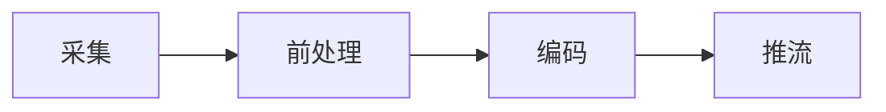

# PC直播调研

## 都有哪些环节

### 推流流程

- 视频采样用RGB/YUV格式、音频采样用PCM格式、压缩体积提高效率
- 前处理（美颜、水印、模糊）
- 编码：压缩音视频体积，视频一般H.265,Vp9、音频一般wmv、mp3、aac
- 推流：使用传输协议将音视频数据封装成流数据、通过Qos

## 用到什么技术

* 多路音视频技术
* 自由放大与拖动任一路视频
* 内嵌IDE
* CDN
* 对象存储

## 第三方

腾讯云

功能

阿里云

